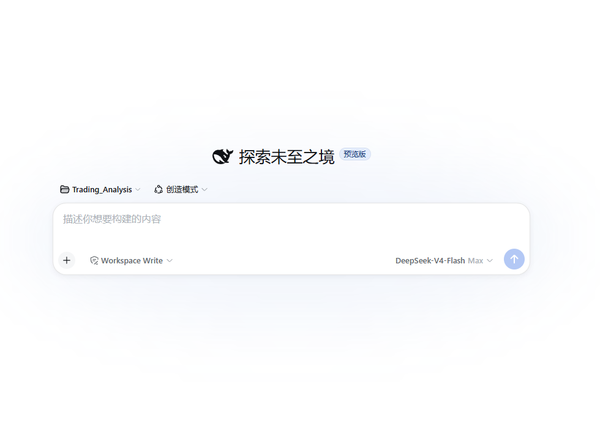

<h1 align="center">
  
  <br />
  DeepSeek Harness Desktop
</h1>

<p align="center">
  A desktop entry point for DeepSeek Harness — <strong>download, install, double-click, and it just works</strong>, always up to date.
</p>

<p align="center">
  Unofficial desktop shell for the <a href="https://github.com/deepseek-ai/deepseek-harness">deepseek-ai/deepseek-harness</a> project (Tauri 2 + WebView2), auto-syncing the official <code>master</code> branch.
</p>

<p align="center">
  <a href="https://github.com/Myoontyee/deepseek-harness-desktop/releases/latest"></a>
  <a href="LICENSE"></a>
  <a href="https://github.com/Myoontyee/deepseek-harness-desktop/actions/workflows/release.yml"></a>
  
  
  
</p>

<p align="center">
  <a href="https://myoontyee.github.io/deepseek-harness-desktop"><strong>Official Website</strong></a>
  &nbsp;·&nbsp;
  <a href="https://github.com/deepseek-ai/deepseek-harness"><strong>DeepSeek Harness Source</strong></a>
</p>

<p align="center"><a href="README.md">简体中文</a> · <strong>English</strong></p>

---

## 📸 Preview



## ⬇️ Download

| Platform | Architecture | Package | Download |
| --- | --- | --- | --- |
| Windows | x64 | Setup installer (95MB, bundled runtime + source snapshot) | [Download](https://github.com/Myoontyee/deepseek-harness-desktop/releases/latest/download/DeepSeek.Harness_0.1.0-rc.5_x64-setup.exe) |
| macOS | Apple Silicon | DMG (73MB) | [Download](https://github.com/Myoontyee/deepseek-harness-desktop/releases/latest/download/DeepSeek.Harness_0.1.0-rc.5_aarch64.dmg) |
| Linux | x64 | AppImage (141MB) | [Download](https://github.com/Myoontyee/deepseek-harness-desktop/releases/latest/download/DeepSeek.Harness_0.1.0-rc.5_amd64.AppImage) |
| Debian / Ubuntu | x64 | deb (82MB) | [Download](https://github.com/Myoontyee/deepseek-harness-desktop/releases/latest/download/DeepSeek.Harness_0.1.0-rc.5_amd64.deb) |

All historical versions: [GitHub Releases](https://github.com/Myoontyee/deepseek-harness-desktop/releases).

> [!IMPORTANT]
> Unofficial community wrapper, early-stage project. Windows builds are not commercially code-signed; macOS builds are not Apple-notarized.

## ✨ Why this project exists

DeepSeek Harness already provides the complete agent runtime and Web UI. This project supplies the host capabilities required for a desktop product:

- **Zero prerequisites**: bundles portable Node.js and pnpm — no runtime installation needed on the target machine
- **Offline-first**: the installer ships the official source snapshot (18MB) — **first run initializes with zero network**; works without any connectivity
- **Always latest**: auto-syncs the official `master` branch when online — upstream updates become app updates
- **China-network aware**: auto-detects the system proxy (Clash etc.) for git, multi-level fallback (snapshot → clone → ZIP), never hangs
- **System tray**: closing the window hides to the tray and the service keeps running; single-instance
- **Self-healing**: automatic reload on web boot failure, automatic port fallback on conflicts

## 🧱 Architecture

```
┌──────────────────────────────────────────────────────────────┐
│  DeepSeek Harness Desktop (this repo)                         │
│  ├─ Desktop shell (Tauri 2 + WebView2, ~3MB, Rust)            │
│  ├─ Bundled runtime tools/ (shipped with the installer)       │
│  │   ├─ node/    portable Node.js                             │
│  │   └─ pnpm     portable pnpm                                │
│  ├─ Bundled source snapshot dsh-runtime-snapshot.zip          │
│  └─ Runtime dir %LOCALAPPDATA%\DeepSeekHarness\runtime\       │
│      └─ Official source (auto-synced to master)               │
└──────────────────────────────────────────────────────────────┘
         │ boot flow
         ▼
┌──────────────────────────────────────────────────────────────┐
│  1. Validate tools/ (Node + pnpm)                             │
│  2. Sync runtime (snapshot → git clone → ZIP, 3-level fallback)│
│  3. pnpm install (only when deps changed)                     │
│  4. pnpm run build (only when revision changed)               │
│  5. Wait for service readiness (incl. plugin endpoint probe)  │
│  6. Load local service in the window (boot page → Web UI)     │
└──────────────────────────────────────────────────────────────┘
```

## 🚀 Quick start

1. Download the installer for your platform from the table above
2. Install and open — **first run initializes from the bundled snapshot, no network required**; online, it auto-updates to the latest official release
3. Enter your DeepSeek API Key in Settings (or set the `DEEPSEEK_API_KEY` env var and restart)

### Requirements

- Windows 10/11 (WebView2 built-in) · macOS 11+ · Linux (WebKitGTK 4.1)
- ~2GB free disk space
- Online updates need access to GitHub and the npm registry (offline first-run does not)

## 🔨 Building from source

### Prerequisites

- Rust stable toolchain (Windows: MSVC; macOS: Xcode CLT; Linux: gcc)
- Portable runtime tools in `tools/` (CI downloads them automatically; manual setup supported)

### Build

```sh
# Generate the official source snapshot (CI does this automatically)
git -C <official-repo> archive --format=zip -o src-tauri/dsh-runtime-snapshot.zip HEAD

# Build the shell + installers
pnpm dlx @tauri-apps/cli@2 build
# Output: src-tauri/target/release/bundle/{nsis,dmg,appimage,deb}/
```

### Icons

`src-tauri/icons/` is generated by `generate-icon.ps1` from `assets/whale.svg` (official white-background black whale). After changes, run `pnpm dlx @tauri-apps/cli icon app-icon.png` to refresh the full set.

## 🏷️ Version policy

The desktop shell version tracks the official repo version one-to-one:

| Place | Source |
| --- | --- |
| Official repo `deepseek-ai/deepseek-harness` | `version` in `package.json` (e.g. `0.1.0-rc.5`) |
| This repo git tag | `v<official version>` |
| Shell `tauri.conf.json` / `Cargo.toml` | matches the official version |
| Boot page | dynamic `Harness <official> · Desktop <shell>` |

**Release flow**: push a `v*` tag → CI builds Windows/macOS/Linux installers → GitHub Release published.

## ⚙️ Environment variables

| Variable | Purpose | Default |
| --- | --- | --- |
| `DSH_PORT` | service port (auto-fallback when busy) | `3080` |
| `DSH_RUNTIME_DIR` | runtime source directory | `%LOCALAPPDATA%\DeepSeekHarness\runtime` |
| `DSH_TOOLS_DIR` | bundled Node/pnpm directory | `tools` next to the exe |
| `DSH_LOCAL_SOURCE` | local git source (testing) | none |
| `DSH_SKIP_UPDATE=1` | skip update checks, use the existing runtime as-is | none |

## 📁 Directory layout

```
deepseek-harness-desktop/
├── assets/               # icon sources (whale.svg etc.)
├── ui/                   # embedded boot page (magazine-style, compiled into the exe)
├── docs/                 # README screenshots
├── tools/                # portable runtime (Node + pnpm, shipped with installer)
├── src-tauri/
│   ├── src/main.rs       # shell core (boot orchestration / service lifecycle / self-healing)
│   ├── tauri.conf.json   # Tauri config (window / bundling / identity / security)
│   ├── icons/            # full icon set
│   └── capabilities/     # Tauri permissions
├── generate-icon.ps1     # icon generation script
└── main/                 # portable deployment artifacts (not committed)
```

## ❓ FAQ

- **First launch slow?** Snapshot initialization takes seconds (with a percentage progress bar); online updates depend on your network.
- **White screen / plugins not activating?** Auto-reload kicks in (up to 3 times); check `server.log` if it persists.
- **Port already in use?** Falls back to a free port automatically; reuse detection recognizes genuine dsh instances.
- **Can I use it offline?** Yes — after the first install, set `DSH_SKIP_UPDATE=1` for fully offline use.
- **Double-clicking twice?** Single-instance — the second launch focuses the existing window.

## Known limitations

- macOS Intel builds are not published yet (GitHub runner availability; buildable manually)
- Builds are unsigned: Windows SmartScreen / macOS Gatekeeper may warn — choose "Run anyway"

## License

[MIT](LICENSE)
