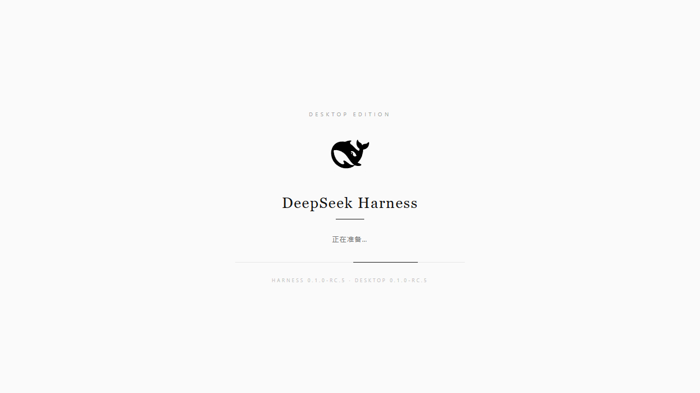

# DeepSeek Harness Desktop

<p align="center">
  <strong>DeepSeek Harness 的桌面端入口</strong>——下载、安装、双击，就是 DeepSeek Harness，并且永远是最新版。
</p>

<p align="center">
  基于 <a href="https://github.com/deepseek-ai/deepseek-harness">deepseek-ai/deepseek-harness</a> 官方项目的非官方桌面壳
  （Tauri 2 + WebView2），自动同步官方 <code>master</code> 分支。
</p>

一个基于 [Tauri 2](https://tauri.app) + WebView2 的轻量桌面壳（约 3MB）。它本身不携带任何 Harness 代码快照：每次启动检查 [deepseek-ai/deepseek-harness](https://github.com/deepseek-ai/deepseek-harness) 官方仓库的最新提交，自动拉取、安装依赖、构建、启动服务，并在独立窗口中打开 Web GUI。**主仓更新即应用更新**，无需手动升级。

---

## ✨ 特性

- **零前置依赖**：内置便携版 Node.js 与 pnpm，目标机器无需安装任何运行时（不需要 Node、pnpm、git）
- **永远最新**：每次启动自动对齐官方 `main` 分支；系统无 git 时整包 ZIP 下载兜底
- **开机即用**：WebView2 窗口内置启动页（白底杂志风），实时显示启动状态与双版本号
- **静默服务**：`pnpm dsh web` 服务以无窗口方式在后台运行，日志落盘 `server.log`，窗口关闭即整体退出，无残留进程
- **数据隔离**：用户数据（会话、设置）保存在 `~/.dsh`，与应用安装位置无关，升级不丢数据
- **版本对齐**：桌面壳版本号与官方代码仓版本号保持一一对应（见 [版本策略](#-版本策略)）
- **离线友好**：`DSH_SKIP_UPDATE=1` 可完全跳过更新检查，使用本地已就绪的运行环境

## 📸 预览

| 启动页 | 主界面 |
| --- | --- |
|  |  |

## 🧱 架构

```
┌──────────────────────────────────────────────────────────────┐
│  DeepSeek Harness Desktop（本仓库）                           │
│  ├─ 桌面壳（Tauri + WebView2，约 3MB，Rust）                  │
│  ├─ 内置运行时工具 tools/（随安装包分发）                     │
│  │   ├─ node/    便携版 Node.js                               │
│  │   └─ pnpm.exe 便携版 pnpm                                  │
│  └─ 运行时目录 %LOCALAPPDATA%\DeepSeekHarness\runtime\        │
│      └─ DeepSeek Harness 官方源码（自动保持 main 分支最新）    │
└──────────────────────────────────────────────────────────────┘
         │ 启动流程
         ▼
┌──────────────────────────────────────────────────────────────┐
│  1. 校验 tools/（Node + pnpm）                                │
│  2. 同步 runtime（git fetch / ZIP 下载，可跳过）              │
│  3. pnpm install（依赖变化时才执行）                          │
│  4. pnpm run build（版本变化时才执行，含标记缓存）            │
│  5. 等待服务就绪（含插件端点探活）                            │
│  6. WebView2 窗口加载 http://127.0.0.1:3080                   │
│     └─ 启动页 → Web UI（失败自动重载，最多 3 次）             │
└──────────────────────────────────────────────────────────────┘
```

## 🚀 快速开始

### 安装（Windows 10/11）

1. 在 [Releases](https://github.com/Myoontyee/deepseek-harness-desktop/releases) 下载
   `DeepSeek Harness Setup.exe`（约 60MB，包含 Node.js 与 pnpm）。
2. 双击安装，按提示完成（无需管理员权限，装到当前用户目录）。
3. 首次打开：应用会下载 Harness 最新代码并安装依赖，**首次需要几分钟**，
   进度与日志在启动窗口中可见；之后每次打开只需几秒。
4. 首次使用请在界面"设置"中填入你的 DeepSeek API Key
   （或设置环境变量 `DEEPSEEK_API_KEY` 后重启应用）。

### 免安装便携版

将构建产物目录（`DeepSeek Harness.exe` + `tools/`）整体拷贝即可运行；
也可在 [Releases](https://github.com/Myoontyee/deepseek-harness-desktop/releases) 获取安装包。

### 依赖要求

- Windows 10/11（自带 WebView2）
- 能访问 GitHub 与 npm registry 的网络（首次运行需要）
- 约 2GB 可用磁盘空间

## 🔨 从源码构建

### 前置条件

- Rust stable MSVC 工具链
- 便携版运行时工具（`tools/`）：

```sh
# 手动准备：nodejs.org 的 win-x64 zip → tools/node/
#           pnpm 的 pnpm-win32-x64.zip → tools/pnpm.exe
```

### 构建桌面壳

```sh
cd src-tauri
cargo build --release
# 产物：src-tauri/target/release/dsh-desktop.exe
# 使用：把 tools/ 放在 exe 同目录即可运行
```

### 生成 NSIS 安装包

```sh
# 需先准备好 tools/
pnpm dlx @tauri-apps/cli build --bundles nsis
# 产物：src-tauri/target/release/bundle/nsis/DeepSeek Harness_<version>_x64-setup.exe
```

### 图标

`src-tauri/icons/` 下的全套图标由 `generate-icon.ps1` 从 `assets/whale.svg`
（WebUI 白底黑鲸鱼路径）生成；修改后重新运行并在仓库根目录执行
`pnpm dlx @tauri-apps/cli icon app-icon.png` 刷新全套尺寸。

## 🏷️ 版本策略

桌面壳版本号与官方代码仓版本号**一一对应**：

| 位置 | 版本来源 |
| --- | --- |
| 官方代码仓 `deepseek-ai/deepseek-harness` | `package.json` 的 `version`（如 `0.1.0-rc.5`） |
| 本仓库 git tag | `v<官方版本>`（如 `v0.1.0-rc.5`） |
| 桌面壳 `src-tauri/tauri.conf.json` + `Cargo.toml` | 与官方版本一致 |
| exe 文件版本 / 安装包文件名 | 与官方版本一致 |
| 启动页封面 | 动态显示 `Harness <官方版本> · Desktop <本仓版本>` |

**发版流程**：官方仓发新版本 → 本仓同步 `version` → 构建 → 打 tag → 发布 Release。

## ⚙️ 环境变量

| 变量 | 作用 | 默认 |
| --- | --- | --- |
| `DSH_PORT` | 服务端口 | `3080` |
| `DSH_RUNTIME_DIR` | 运行时源码目录 | `%LOCALAPPDATA%\DeepSeekHarness\runtime` |
| `DSH_TOOLS_DIR` | 内置 Node/pnpm 目录 | exe 同目录 `tools` |
| `DSH_LOCAL_SOURCE` | 本地 git 源（开发测试） | 无 |
| `DSH_SKIP_UPDATE=1` | 跳过更新检查，直接使用现有运行时 | 无 |

## 📁 目录结构

```
deepseek-harness-desktop/
├── assets/               # 图标源（whale.svg 等）
├── ui/                   # 内置启动页（白底杂志风，嵌入 exe）
├── tools/                # 便携式运行时（Node + pnpm，随安装包分发）
├── src-tauri/
│   ├── src/main.rs       # 桌面壳主体（启动编排/服务生命周期/故障自愈）
│   ├── tauri.conf.json   # Tauri 配置（窗口/打包/标识）
│   ├── icons/            # 应用图标全套
│   └── capabilities/     # Tauri 权限
├── generate-icon.ps1     # 图标生成脚本
└── main/                 # 便携部署产物（exe + tools + 安装包，不入库）
```

## ❓ 常见问题

- **首次启动很慢？** 首次需要下载官方源码并构建（10-30 分钟取决于网络），属正常现象；
  之后每次启动只需几秒。构建进度可在启动窗口日志中查看。
- **启动后白屏/插件未激活？** 应用内置自动重载（最多 3 次）；若仍失败，
  查看 `%LOCALAPPDATA%\DeepSeekHarness\runtime\server.log` 定位问题。
- **离线环境可用吗？** 首次安装需要联网；之后若设置 `DSH_SKIP_UPDATE=1` 可离线启动。
- **重复双击会怎样？** 应用未做单实例互斥，会打开多个窗口（服务复用同一端口）。

## 已知限制

- 仅支持 Windows（WebView2 + 无窗口服务）；macOS/Linux 需另行适配
- 更新依赖主仓公开可读；主仓未公开前需自行配置可达的源码源

## License

[MIT](LICENSE)
